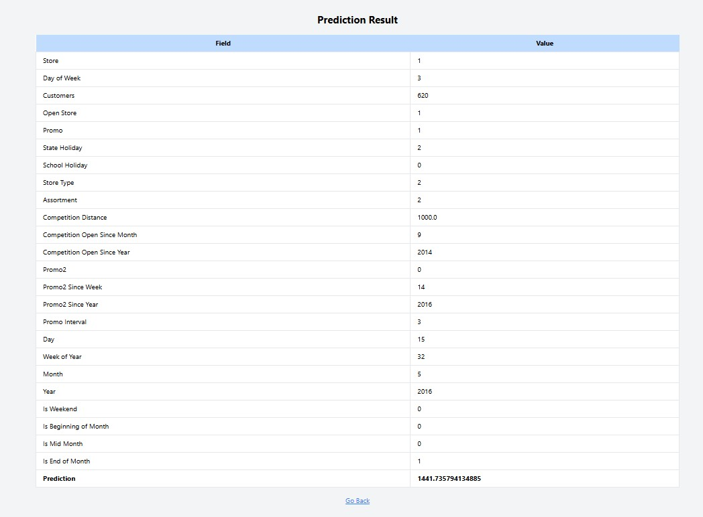

---

# Sales Forecasting and Customer Behavior Analysis for Rossmann Pharmaceuticals Using Machine Learning and Deep Learning 📊🤖

### Overview
This project focuses on predicting future sales for Rossmann Pharmaceuticals' stores using a combination of machine learning and deep learning techniques. The project aims to deliver actionable sales forecasts, allowing the finance team to plan and allocate resources efficiently. The solution includes detailed exploratory data analysis, machine learning modeling, deep learning with LSTM for time series prediction, and serving the predictions through a web API. 💡

### Business Need (Motivation)
At Rossmann Pharmaceuticals, store managers rely on personal judgment and years of experience to forecast sales, which may lead to inaccurate or inconsistent projections. The finance team needs a robust and scalable solution to predict sales for all stores across various cities six weeks ahead of time. The ability to forecast sales accurately will support better resource allocation and decision-making based on factors such as promotions, holidays, and competition. 📅💼

### Objective
The primary objective of this project is to build and deploy an end-to-end machine learning and deep learning solution for Rossmann Pharmaceuticals to forecast store sales up to six weeks in advance. Key objectives include:

- Conducting exploratory data analysis (EDA) to understand customer purchasing behavior. 📊
- Developing an optimized predictive model using machine learning and deep learning techniques. 🧠
- Improving decision-making for the finance team, allowing them to optimize resource allocation. 💰
- Serving predictions through a web-based API for real-time access. 🌐
- Offering insights into customer behavior based on factors such as promotions, holidays, and competition. 🎉📈

### Folder Structure 📁
- `src/`: Contains source code for data loading, feature engineering, and EDA.
- `tests/`: Contains unit and integration tests. 🧪
- `data/`: Contains raw and processed data files. 💾
- `logs/`: Contains logging output. 📜
- `.github/`: Contains CI/CD configurations. ⚙️
- `flask-app/`: Contains web API and prediction form. 🌍
- `notebook/`: Contains the prediction, preprocessing, and analysis model. 📚
- `scripts/`: Contains the main script to run and visualize results. 🎬

### How to Use 🚀
1. Clone the repository:
   ```bash
   git clone "https://github.com/jonnahjr/KAIM2W4-rossmann-sales-forecast.git"
   ```
2. Navigate to the project directory:
   ```bash
   cd KAIM2W4-rossmann-sales-forecast
   ```
3. Install dependencies:
   ```bash
   pip install -r requirements.txt
   ```
4. Start the project:
   ```bash
   python scripts/main.py
   ```
5. To forecast store sales, use:
   ```bash
   python flask-app/app.py
   ```
   Open your browser and paste `http://127.0.0.1:5000` 🌐

   Fill the form and submit to get the prediction result. ✨

### Results 📈
Below is an example of the sales forecast visualization generated by the project:

**Prediction** 📊💡

### Contributing 🤝
Contributions are welcome! Please follow these steps:
1. Fork the repository. 🍴
2. Create a new branch (`git checkout -b feature-branch`). 🌱
3. Make your changes and commit them (`git commit -m 'Add new feature'`). 📝
4. Push to the branch (`git push origin feature-branch`). 🚀
5. Open a pull request. 🔄

### Conclusion 🎯
This project provides a comprehensive machine learning pipeline for sales forecasting and customer behavior analysis. By leveraging data-driven insights and deploying prediction models through a web interface, Rossmann Pharmaceuticals can make informed decisions to optimize store operations and resource allocation. 💼📊

### Contact Information 📧
**Yonas Bogale** (formerly Getachew Getu)  
GitHub: [jonnahjr](https://github.com/jonnahjr)  
Email: [jonasjjonas14@gmail.com](mailto:jonasjjonas14@gmail.com)  
LinkedIn: [Yonas Bogale](https://www.linkedin.com/in/yonasbogale) 🔗

### License 📜
This project is licensed under the Apache License 2.0. See the LICENSE file for more details. ✨

---
